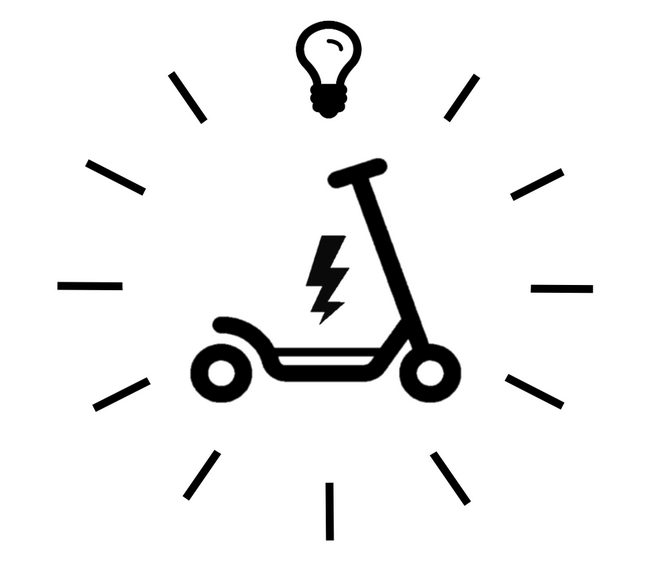
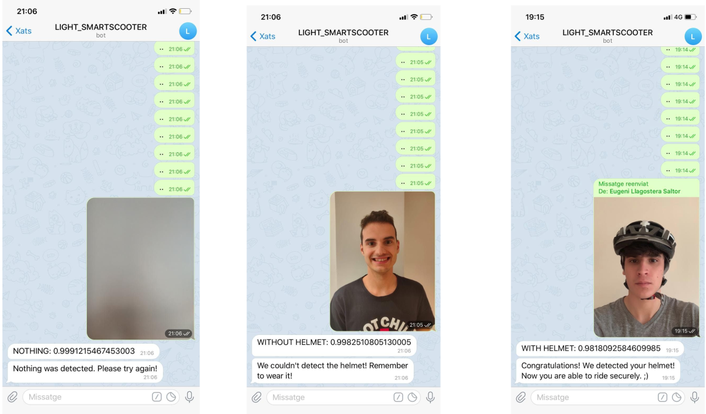

# Smart Scooter ETSEIB Project

This project is formed by a group of students and professors at the [UPC-ETSEIB](https://etseib.upc.edu) with the aim of developing technological systems that convert a conventional electric scooter to an intelligent one.

​The challenge was to overcome the challenges of the [Smart Scooter Challenge](http://www.smartmotochallenge.org/castelloli-smart-scooter-challenge/home.html). However there has been more developements. You can find more information avout them in the oficial [Smart Sooter Etseib website](https://eugenillagostera.wixsite.com/smartscooter).

## [Object Detectors](object_detectors)
In here you will find the code to create a Traffic Lights with and without color detector as well as a cones detector. It all has been tested on Linux and Raspberry Pi 4.

## [Node-RED Dashboards](dashboards)
To display the information of every solution, there is a Node-RED flow (.json) for it, with a complete dashboard.

This [flow](dashboards/helmet) uses the Teachable Machine tool (together with the [TM node-red node](https://flows.nodered.org/node/node-red-contrib-teachable-machine)) and a Telegramm Bot, to classify wether the rider wears or not a safety helmet.

Examples:

## [Helmet](helmet)
Here you'll find the necessary code (Arduino) to create the communication between the [dashboard](dashboards/helmet_leds.json) and the ESP32, through MQTT, and the code to light up the LED's of the Matrix.

To find more info about this solution, read this [paper](https://upcommons.upc.edu/handle/2117/337087).

## [Zone Classifier](zone_classifier)
In here you will find the code to create a scooter riding zone classifier, as well as all the backend code (Go) to create the endpoint and do the inference.

