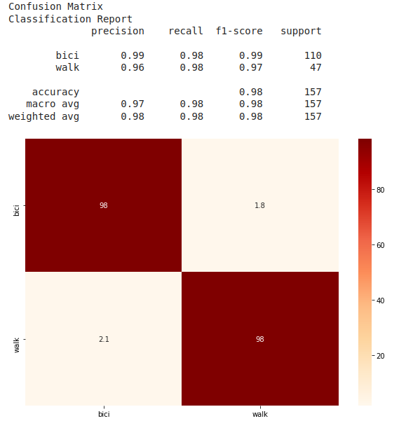
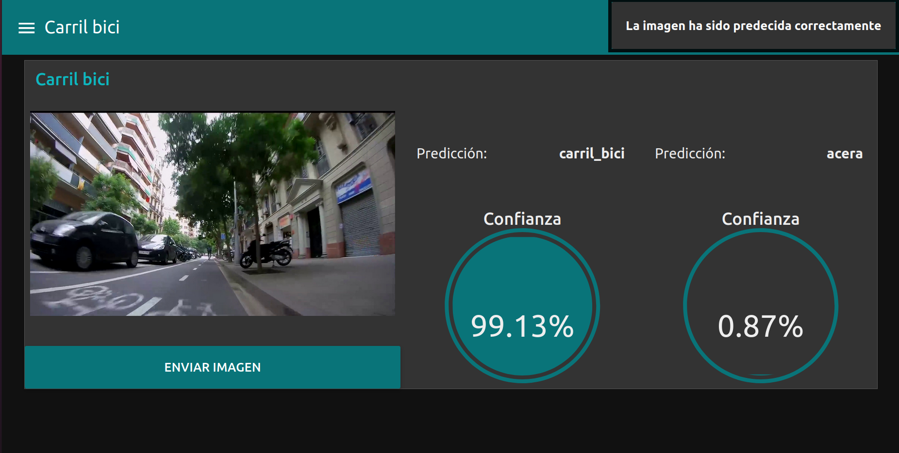
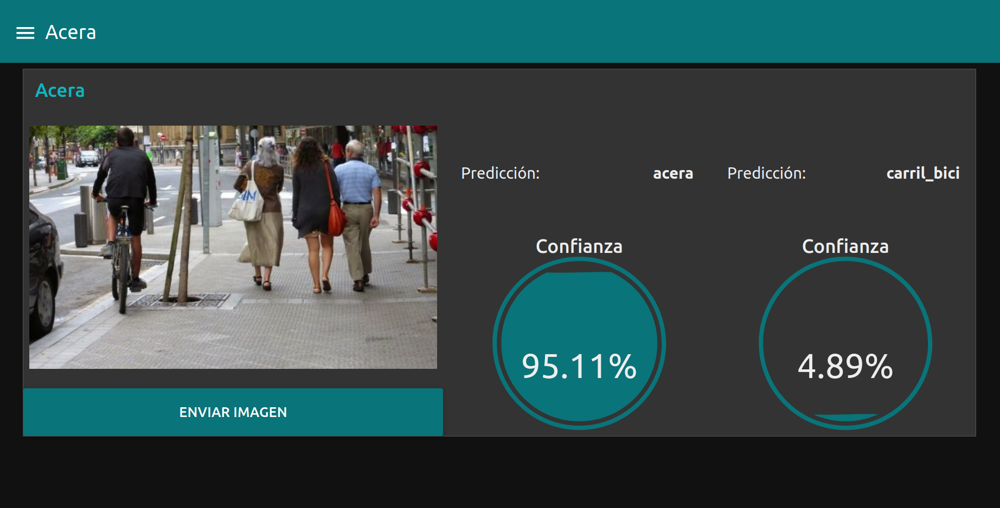

# Smart Scooter Zone Classifier files

## Create the model

To create the model, git clone this repository to your Google Colab, and follow the instructions of one of this two ipynb:
- [Zone Classifier](Zone_Classifier.ipynb)

## Evaluation Results

## Backend

In order to do the inference to the created image classifier, instead of doing it on the device (laptop or Raspberry Pi), we do it on "cloud" (actually you will do it where you run the backend, which can be on the same device).

To run it you just have to cd to **zone_classifier/backend** and type this on your terminal: `go run ./cmd/serve/main.go`.
It will load the saved model on the **ai_models** folder and listen and serve HTTP POST requests on localhost:1234/ai/prediction

To send POST requests, refer to the [Node-RED flow](../dashboards/zone_classifier.json).It doesn't count with any DB. Just request and response.

Examples:

It has been created following the SOLID principles and trying to adapt it to the Hexagonal architechture, separating functionalities as: Service > App > Model Inference.

## References:
- Tensorflow Go: https://github.com/tensorflow/build/tree/master/golang_install_guide
